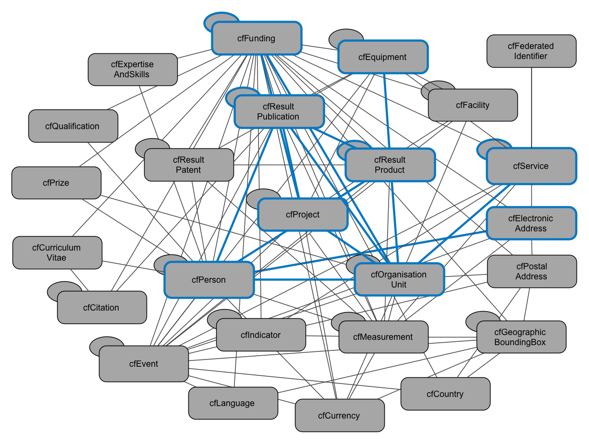

CRIS information elements relevant for OpenAIRE
-----------------------------------------------

CERIF is a comprehensive domain model that allows for the formal description of many aspects (contexts) inherent in the Research domain, some of them not present in the OpenAIRE information space, which currently does not aim to represent the full range of information in CERIF. The Guidelines therefore focus on those information elements in a CRIS system that are considered relevant and can be utilised within the current scope and data model of the OpenAIRE infrastructure. The interoperability use case supported by the Guidelines is the harvesting of data from individual CRIS systems by the OpenAIRE infrastructure. The data harvested should be in CERIF XML and in particular comply with a specialisation of the CERIF XML Schema that defines an OpenAIRE-specific CERIF subset. This is an example of a point-to-point exchange of CRIS information in CERIF XML for a particular application domain. The specialised OpenAIRE CERIF XML Schema is designed so that every XML file that is valid according to it is also valid according to the standard CERIF XML Schema 1.6.

The Guidelines describe the subset of the CERIF data model and the relevant specialisations that constitute the set of elements for harvesting from CRIS systems through OpenAIRE. The OpenAIRE-specific elements indicated in Figure 1 discern the identified objects (e.g. person), their attributes (e.g. gender) and some compounding sets of functional vocabularies (e.g. “Author” applicable in a person-publication relationship) for setting the boundaries. The formal model is defined as an OpenAIRE-specific CERIF XML Schema specification, which is provided separately from the present document. 
The following tables define the CERIF data elements to be utilised for the exchange of data between individual CRIS systems and the OpenAIRE infrastructure. The exclusive use of the defined data elements and vocabularies is mandatory, i.e. no other data elements and vocabularies can be used in the CERIF XML data exposed by CRIS systems to the OpenAIRE infrastructure. The vocabularies as currently applied or listed in the below guideline tables are mostly based on the CERIF 1.5 Semantics. Extensions are possible and will be reflected in a release after the review.
